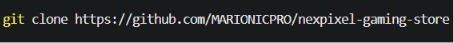
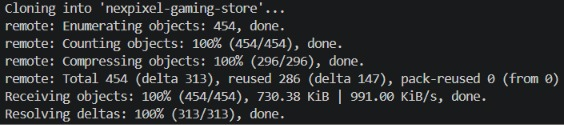
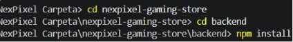
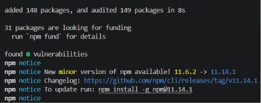
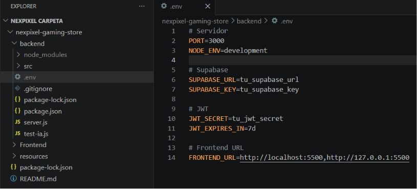
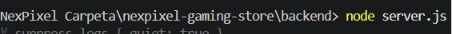
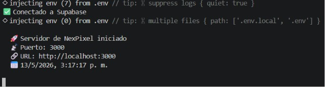
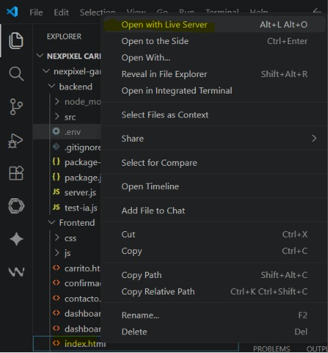
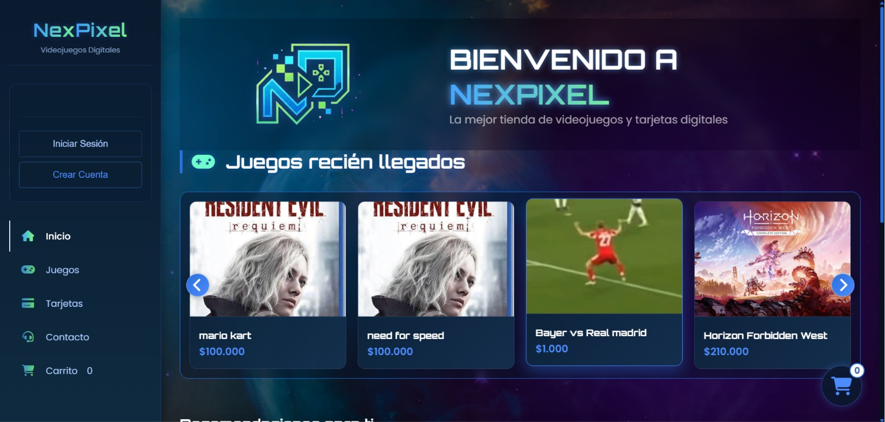

# 🎮 NexPixel Gaming Store

Proyecto de e-commerce para la venta de códigos digitales de videojuegos.  
Permite a los usuarios explorar productos, agregarlos al carrito y realizar compras en línea.

---

## 🚀 Funcionalidades

* 🛒 Carrito de compras
* 🎮 Catálogo de videojuegos
* 🔍 Visualización de productos
* 💳 Simulación de compra
* 🌐 Interfaz web interactiva

---

## 🛠 Tecnologías utilizadas

### 🎨 Frontend

* HTML5
* CSS3
* JavaScript

### ⚙️ Backend

* Node.js

### 🗄️ Base de datos

* Supabase

### 🚀 Despliegue

* Vercel

---

# ⚙️ Instalación y ejecución del proyecto

## 📌 Requisitos previos

Antes de ejecutar el proyecto es necesario tener instalado:

* Node.js
* npm
* Visual Studio Code
* Extensión Live Server para Visual Studio Code

---

## 📥 1. Clonar el repositorio

Crear o abrir una carpeta en cualquier ubicación del computador, por ejemplo:

* Documentos
* Descargas
* Escritorio

Luego abrir una terminal en esa carpeta y ejecutar:

```bash
git clone https://github.com/MARIONICPRO/nexpixel-gaming-store.git
```

### Comando de clonación



### Resultado de la clonación



---

## 📂 2. Ingresar a la carpeta del proyecto

Después de clonar el repositorio ejecutar:

```bash
cd nexpixel-gaming-store
```

Luego ingresar a la carpeta backend:

```bash
cd backend
```

### Navegación entre carpetas e instalación



---

## 📦 3. Instalar dependencias

Dentro de la carpeta backend ejecutar:

```bash
npm install
```

Este comando instala todas las dependencias necesarias para el funcionamiento del servidor.

### Resultado de instalación de dependencias



---

## 🔐 4. Configurar variables de entorno

Crear un archivo `.env` dentro de la carpeta backend.

Este archivo contiene configuraciones importantes del servidor y conexión con la base de datos.

Ejemplo:

```env
# Servidor
PORT=3000
NODE_ENV=development

# Supabase
SUPABASE_URL=tu_supabase_url
SUPABASE_KEY=tu_supabase_key

# JWT
JWT_SECRET=tu_jwt_secret
JWT_EXPIRES_IN=7d

# Frontend URL
FRONTEND_URL=http://localhost:5500,http://127.0.0.1:5500
```

⚠️ Nunca compartir claves reales ni subir el archivo `.env` al repositorio.

### Configuración del archivo .env



---

## ▶️ 5. Ejecutar el backend

Dentro de la carpeta backend ejecutar:

```bash
node server.js
```

### Ejecución del servidor



### Resultado del servidor ejecutándose



---

## 🌐 6. Ejecutar el frontend

Abrir el archivo `index.html` ubicado en la carpeta Frontend.

Luego:

1. Hacer click derecho sobre `index.html`
2. Seleccionar la opción **Open with Live Server**

### Ejecución con Live Server



---

## ✅ 7. Proyecto funcionando

Si todos los pasos fueron realizados correctamente:

* El backend estará conectado correctamente.
* Los productos se cargarán desde la base de datos.
* La interfaz funcionará correctamente.

### Proyecto ejecutándose correctamente



---

## 🔒 Archivo ignorado por Git

El archivo `.env` se encuentra agregado al `.gitignore` para proteger información sensible del proyecto.

---

## 👥 Equipo de desarrollo

Proyecto desarrollado en equipo bajo división de roles:

* 👨‍💻 **Thomas Ávila** – Frontend (interfaz, interacción y experiencia de usuario)
* 👨‍💻 **Ivan Clavijo** – Backend (lógica del servidor con Node.js, integración de IA)
* 🗄️ **David Sopó** – Base de datos (gestión y modelado en Supabase)
* 📈 **David Vargas** – Marketing (estrategia y presentación del producto)

---

## 🔗 Perfiles del equipo

* Thomas Avila: https://github.com/Sebas-avila-hash
* Ivan Clavijo: https://github.com/MARIONICPRO
* David Sopó: https://github.com/Davidhxsqd18
* David Vargas: https://github.com/DGVR007

